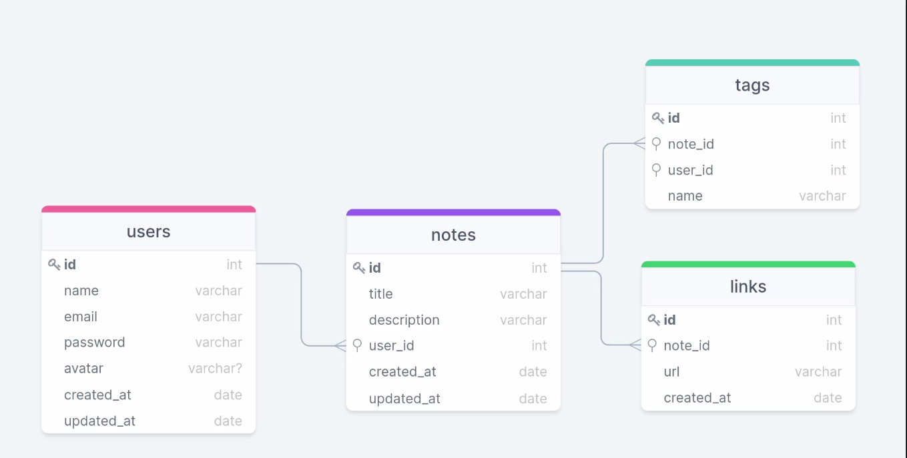

<h1 align="center">Explorer- Aula01 - Rockenotes -Stage08</h1>

&nbsp;&nbsp;&nbsp;

 

---

## 💻 Projeto - API Rocketnotes

Projeto realizado durante o programa Explorer da Rocketseat. Localizado no nível 8, onde construimos uma API completa utilizando NodeJS e Express. Criamos e manipulamos um banco de dados SQLite utilizando o Query Builder Knex.js.

Imagem Banco de Dados 

🚀 O que é o Node.js?  
🚀 Onde o Node.js pode ser utilizado  
🚀 Vantagens do Node.js  
🚀 v8 Engine  
🚀 O funcionamento do Node.js

## 🤔 O que aprendi após finalizar esse módulo?

- [ ] O que é API;
- [ ] O que é o Node.js;
- [ ] Onde podemos utilizar o Node.js;
- [ ] Vantagens do Node.js;
- [ ] O que é a v8 Engine;
- [ ] Como funciona o Node.js;

# Criando uma aplicação Node.js

🚀 Iniciando um projeto Node.js  
🚀 Adicionando Express  
🚀 node_modules  
🚀 Iniciando o Express  
🚀 Executando a aplicação  
🚀 Rotas e Métodos HTTP  
🚀 Método GET  
🚀 Route Params  
🚀 Query Params  
🚀 Nodemon  
🚀 Insomnia  
🚀 Método POST  
🚀 Body Params  
🚀 Organizando a estrutura do projeto  
🚀 Controllers  
🚀 Users Controller  
🚀 HTTP Codes  
🚀 Entendendo Middlewares  
🚀 Utilizando Middleware  
🚀 AppError  
🚀 Tratando exceções  
🚀 Configurando o Insomnia

## 🤔 O que aprendi após finalizar esse módulo?

- [ ] Iniciar um projeto Node.js;
- [ ] Adicionar Express no projeto;
- [ ] O que é a pasta `node_modules`;
- [ ] Rotas;
- [ ] Métodos HTTP;
- [ ] Route Params;
- [ ] Query Params;
- [ ] Instalação e utilização do `nodemon`;
- [ ] Instalação e utilização do `Insomnia`;
- [ ] Body Params;
- [ ] Controller;
- [ ] HTTP Status Codes;
- [ ] Middleware;
- [ ] Lidar com erros na API;

# SQL

🚀 O que é um banco de dados  
🚀 Estrutura do banco de dados  
🚀 Conectando com o banco de dados  
🚀 SGBD  
🚀 Criando tabela de usuário  
🚀 SQL  
🚀 Alter  
🚀 Comando DDL  
🚀 Manipulando dados  
🚀 Migrations  
🚀 Select  
🚀 Cadastrando usuário  
🚀 Criptografando senha do usuário  
🚀 Atualizando usuário  
🚀 Atualizando senha  
🚀 Datetime do Banco  
🚀 Validando nome e e-mail

## 🤔 O que aprendi após finalizar esse módulo?

- [ ] O que é um banco de dados;
- [ ] Como conectar um banco de dados SQLite;
- [ ] Utilização da ferramenta Beekeper Studio;
- [ ] Comandos DML;
- [ ] Comandos DDL;
- [ ] Migrations;
- [ ] Fazer consultas no SQL;
- [ ] Criptografar senhas no banco de dados;
- [ ] Validações no back-end;

# Query Builder

🚀 O que é um SQL Query Builder  
🚀 Instalando Knex.js  
🚀 Configurando Knex.js  
🚀 Conceito de Migrations  
🚀 Migrations para Notes  
🚀 NPM vs NPX  
🚀 Primary key e Foreign key  
🚀 Cardinalidade  
🚀 Operador Like  
🚀 Filtro WhereIn  
🚀 Conceito de Inner Join  
🚀 Aplicando Inner Join  
🚀 Map e Filter

## 🤔 O que aprendi após finalizar esse módulo?

- [ ] SQL Query Builder;
- [ ] Instalar Knex/js;
- [ ] Configurar Knex.js;
- [ ] NPM vs NPX;
- [ ] Primary Key;
- [ ] Foreign Key;
- [ ] Cardinalidade;
- [ ] Inner Join;
- [ ] Map e Filter;

##  📕 Sobre  

Este é um projeto desenvolvido em treinamento, juntamente com a 
<a  href="https://www.rocketseat.com.br">Rocketseat</a> 🚀
no decorrer do programa <b>Explorer</b>.

### Informações  

📅 **10.08.2023**

🕛 **Status:** Concluído✔️

Developed by Jeferson 🚀

